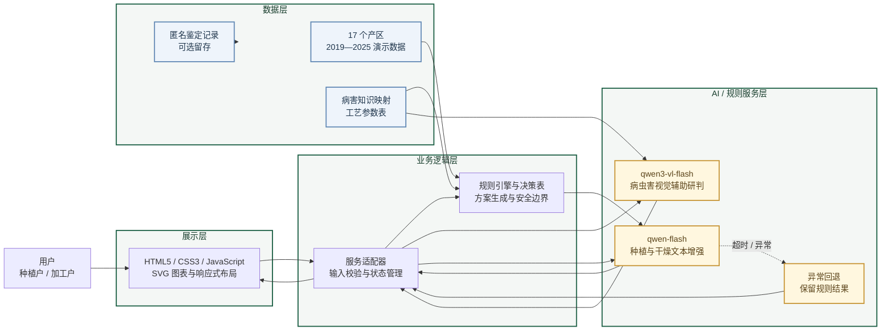

# 星茴智农系统四层架构

该图展示展示层、业务逻辑层、AI/规则服务层和数据层，以及规则优先、AI增强、异常回退的数据流。

```mermaid
flowchart LR
  user["用户\n种植户 / 加工户"] --> view
  subgraph presentation["展示层"]
    view["HTML5 / CSS3 / JavaScript\nSVG 图表与响应式布局"]
  end
  subgraph business["业务逻辑层"]
    adapter["服务适配器\n输入校验与状态管理"]
    rules["规则引擎与决策表\n方案生成与安全边界"]
  end
  subgraph service["AI / 规则服务层"]
    vision["qwen3-vl-flash\n病虫害视觉辅助研判"]
    text["qwen-flash\n种植与干燥文本增强"]
    fallback["异常回退\n保留规则结果"]
  end
  subgraph data["数据层"]
    demo["17 个产区\n2019—2025 演示数据"]
    knowledge["病害知识映射\n工艺参数表"]
    records["匿名鉴定记录\n可选留存"]
  end
  view --> adapter
  adapter --> rules
  adapter --> vision
  adapter --> text
  rules --> text
  vision --> adapter
  text --> adapter
  text -.超时 / 异常.-> fallback
  fallback --> adapter
  demo --> rules
  knowledge --> rules
  knowledge --> vision
  records --> data
  adapter --> view
  classDef layer fill:#f4f7f5,stroke:#195d42,stroke-width:2px,color:#173d2c;
  classDef ai fill:#fff7df,stroke:#c79535,stroke-width:2px,color:#5a4319;
  classDef store fill:#eef4fb,stroke:#6289b5,stroke-width:2px,color:#20364c;
  class presentation,business,service,data layer;
  class vision,text,fallback ai;
  class demo,knowledge,records store;
```
