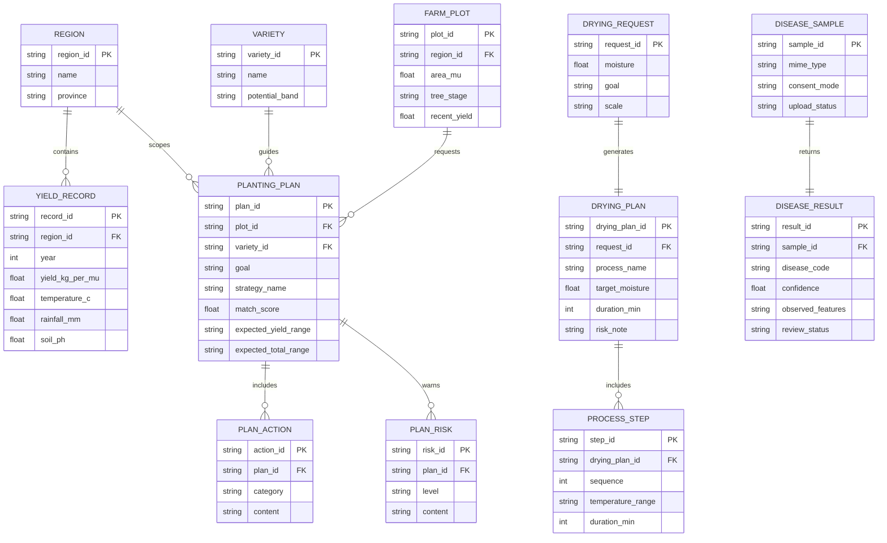

# 星茴智农数据模型设计

该图将产区、历史产量、地块、品种、种植方案、干燥方案和病害识别结果拆分为可追踪对象，适合作为原创性材料中的数据模型设计图。

```mermaid
erDiagram
  REGION ||--o{ YIELD_RECORD : contains
  REGION ||--o{ PLANTING_PLAN : scopes
  VARIETY ||--o{ PLANTING_PLAN : guides
  FARM_PLOT ||--o{ PLANTING_PLAN : requests
  PLANTING_PLAN ||--o{ PLAN_ACTION : includes
  PLANTING_PLAN ||--o{ PLAN_RISK : warns
  DRYING_REQUEST ||--|| DRYING_PLAN : generates
  DRYING_PLAN ||--o{ PROCESS_STEP : includes
  DISEASE_SAMPLE ||--|| DISEASE_RESULT : returns

  REGION {
    string region_id PK
    string name
    string province
  }
  YIELD_RECORD {
    string record_id PK
    string region_id FK
    int year
    float yield_kg_per_mu
    float temperature_c
    float rainfall_mm
    float soil_ph
  }
  VARIETY {
    string variety_id PK
    string name
    string potential_band
  }
  FARM_PLOT {
    string plot_id PK
    string region_id FK
    float area_mu
    string tree_stage
    float recent_yield
  }
  PLANTING_PLAN {
    string plan_id PK
    string plot_id FK
    string variety_id FK
    string goal
    string strategy_name
    float match_score
    string expected_yield_range
    string expected_total_range
  }
  PLAN_ACTION {
    string action_id PK
    string plan_id FK
    string category
    string content
  }
  PLAN_RISK {
    string risk_id PK
    string plan_id FK
    string level
    string content
  }
  DRYING_REQUEST {
    string request_id PK
    float moisture
    string goal
    string scale
  }
  DRYING_PLAN {
    string drying_plan_id PK
    string request_id FK
    string process_name
    float target_moisture
    int duration_min
    string risk_note
  }
  PROCESS_STEP {
    string step_id PK
    string drying_plan_id FK
    int sequence
    string temperature_range
    int duration_min
  }
  DISEASE_SAMPLE {
    string sample_id PK
    string mime_type
    string consent_mode
    string upload_status
  }
  DISEASE_RESULT {
    string result_id PK
    string sample_id FK
    string disease_code
    float confidence
    string observed_features
    string review_status
  }
```
